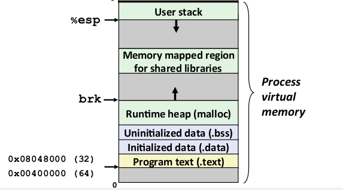
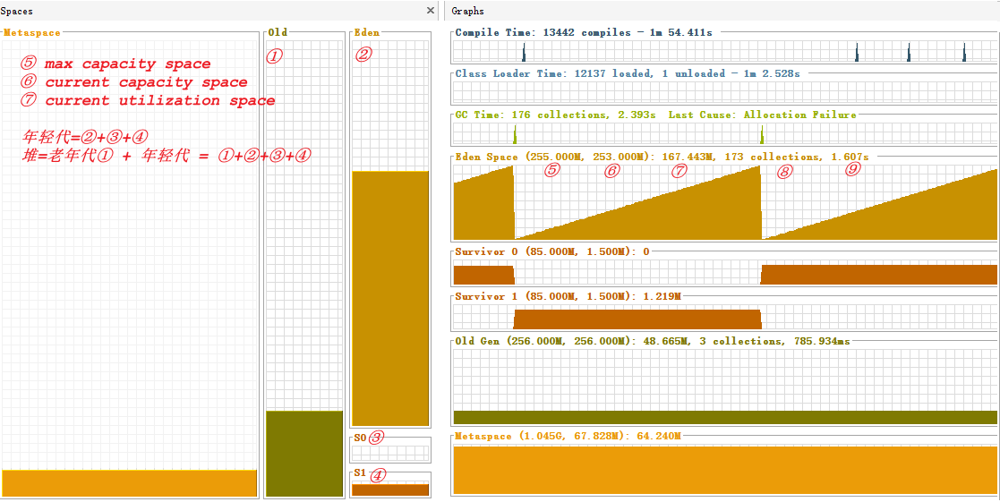
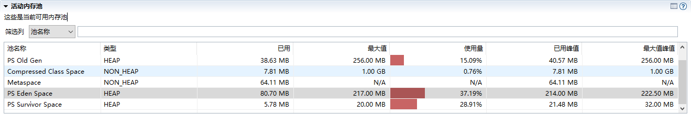

### 作业3: 画一张图 展示 Xmx Xms Xmn Metaspace DirectoryMemory Xss 内存参数的关系

#### 栈大小内存相关设置

(1)-Xss
等同 -XX:ThreadStackSize

#### 堆内存大小相关设置

(1) -Xmx
等同 -XX:MaxHeapSize
设置堆内存最大值

(2)-Xms
设置堆内存初始值大小

(3) -Xmn
设置堆内存中新生代初始值/最大值
默认 已分配堆内存的1/4

#### Meta大小相关设置
(1)-XX:MaxMetaspaceSize
设置用于Native Memory的最大值 分配给类元数据
依赖于操作系统可用内存 其他应用及当前应用

#### 堆外内存DirectoryMemory
(1)-XX:MaxDirectoryMemory
此参数的含义是当Direct ByteBuffer分配的堆外内存到达指定大小后，即触发Full GC
注意该值是有上限的，默认是64M，最大为sun.misc.VM.maxDirectMemory()，在程序中中可以获得-XX:MaxDirectMemorySize的设置的值

### Linux 虚拟内存
分成2个部分，一部分kernel使用（kernel virtual memory）其它的是进程（process virtual memory）使用，如下图所示：

其中：
- ①User stack 是JVM中的stack
- ②Runtime heap（malloc）是JVM中的heap

当程序进行函数调用时，每个函数在stack中有一个call frame

### JVM内存模型结构

- 年轻代= ② + ③ + ④ = Eden新生代 + 存活区0  + 存活区1
- 堆内存 = ①老年代 + ②新生代 + ③存活区0 + ④存活区1

参考:
- visualvm https://www.pianshen.com/article/66651022306/
- 内存池与JVM内存模型 https://blog.csdn.net/qq_43631716/article/details/116348628
